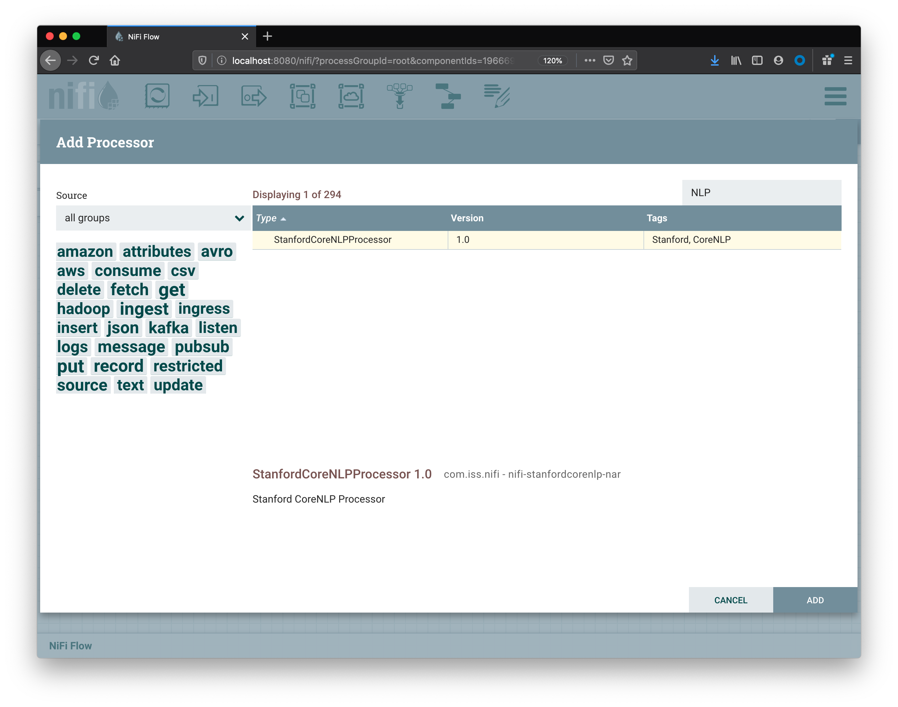
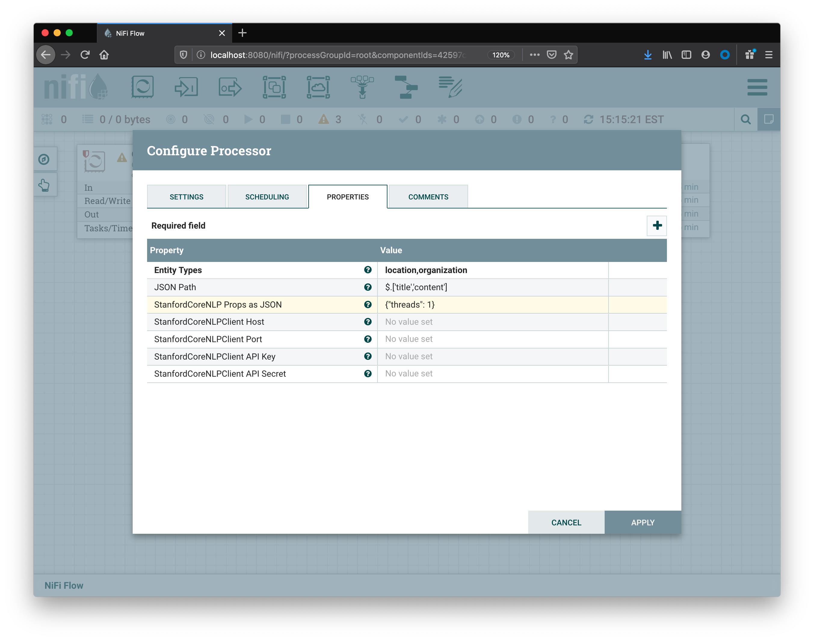

# Nifi Stanford CoreNLP Processor

This project contains a custom processor for [Apache Nifi](https://nifi.apache.org/) which implements a subset of the functionality in the [Stanford CoreNLP](https://stanfordnlp.github.io/CoreNLP/) toolkit.

## Usage

### Create Input File

Create an input folder in a location that Nifi has read access, and add a file called `1.json` there with the contents:

```
{
  "title": "Worldwide film production company opens ABQ facility",
  "content": "ALBUQUERQUE, N.M. — A worldwide film production company is expanding to Albuquerque, according to Albuquerque Business First. The company, Production Resource Group, has worked on various movie productions including \"House of Cards.\" They plan to move into a 6,000-square-foot warehouse space in northeast Albuquerque, located at 5821 Midway Park Blvd. NE.\n\nFor more information, click here.",
}
```

### Add Input / Output Processors

In this example I'm using the standard `GetFile` and `PutFile` processors. They should be configured with input / output folders that Nifi can read / write.

### Add Custom Processor

Assuming the nar file was configured properly in the [Installation](#installation) step, you should be able to search for `Core` or `NLP` to find the `StanfordCoreNLPProcessor`.



### Configure Properties

In the Properties tab of the processor configuration, you will need to configure the entity types that you want to extract from the input as a comma separated list. Here is a brief summary of the configuration options:

* `Entity Types`
  * Description: Lowercase comma separated list of NER tags to extract from text, such as: `location,organization`.
  * Valid Values: `person,location,organization,misc,money,number,ordinal,percent,date,time,duration,set,email,url,city,state_or_province,country,nationality,religion,title,ideology,criminal_charge,cause_of_death`.
  * Notes: when using the `location` entity type, the following other types are automatically also grouped under it: `city,country,state_or_province`. For more information about ner tags, visit the [CoreNLP NER Docs](https://stanfordnlp.github.io/CoreNLP/ner.html#description).
* `JSONPath`
  * Description: The [JSON Path](https://github.com/json-path) from incoming flow file to extract for analyzing, such as: `$.['title','content']`.
  * Notes: If left blank, the flow file will be treated as plain text.
* `StanfordCoreNLP Props as JSON`
  * Description: Properties to configure the StanfordCoreNLP object or StanfordCoreNLPClient object as JSON, such as: `{"threads": 1}`.
* `StanfordCoreNLPClient Host`
  * Description: StanfordCoreNLPClient host address, such as: `http://localhost` 
  * Notes:
    * If left blank, all processing will be performed locally. This requires nifi to be configured with additional memory as noted in the installation section.
    * An external Stanford CoreNLP server can be run with docker: `docker run -p 9000:9000 --name coreNLP --rm -i -t isslab/corenlp:2018-10-05`.
* `StanfordCoreNLPClient Port`
  * Description: StanfordCoreNLPClient port, such as: `9000`.
* `StanfordCoreNLPClient API Key`
  * Description: StanfordCoreNLPClient API Key for servers that have authentication configured, not required.
* `StanfordCoreNLPClient API Secret`
  * Description: StanfordCoreNLPClient API Secret for servers that have authentication configured, not required.



### Add Connections

After the `StanfordCoreNLPProcessor` is configured, connect it with inputs and outputs. The processor can terminate with `success` or `failure` relationships.


### Verify Output

Start all of the processors in your Nifi flow. In the configured output folder for the `PutFile` component, you should see the updated json file:

```
{
  "title": "Worldwide film production company opens ABQ facility",
  "content": "ALBUQUERQUE, N.M. — A worldwide film production company is expanding to Albuquerque, according to Albuquerque Business First. The company, Production Resource Group, has worked on various movie productions including \"House of Cards.\" They plan to move into a 6,000-square-foot warehouse space in northeast Albuquerque, located at 5821 Midway Park Blvd. NE.\n\nFor more information, click here.",
  "organization": [
    "Albuquerque Business First",
    "Production Resource Group"
  ],
  "location": [
    "ALBUQUERQUE",
    "N.M.",
    "Albuquerque",
    "Albuquerque",
    "Midway Park Blvd.",
    "NE"
  ]
}
```

## Installation

Create a directory for custom nifi processors if it doesn't exist:

```
mkdir -p $NIFI_HOME/nars/lib1
```

Copy `nifi-stanfordcorenlp-nar-1.0.nar` to `$NIFI_HOME/nars/lib1`

Update your `$NIFI_HOME/conf/nifi.properties` to include the following:

```
nifi.nar.library.directory.lib1=/nars/lib1
```

Update your `$NIFI_HOME/conf/bootstrap.conf` with increased memory needed for CoreNLP:

```
# JVM memory settings
#java.arg.2=-Xms512m
#java.arg.3=-Xmx512m
java.arg.2=-Xms4g
java.arg.3=-Xmx4g
```

Start nifi as usual

```
nifi start
```

For more information on how to configure custom nar files, visit the [Nifi Documentation](https://nifi.apache.org/docs/nifi-docs/html/administration-guide.html#core-properties-br).

## Build

### Maven

If you have Maven installed, you can build the package with:

```
mvn -DskipTests package
```

### Docker

You can also build using Docker:

```
docker run -v ~/.m2/repository:/usr/share/maven/ref/repository -v $(PWD):/usr/src/app -w /usr/src/app maven:3.5.2-jdk-8-alpine /usr/src/app/docker_entrypoint.sh
```

### Artifacts

After building, your `nar` file will located at `nifi-stanfordcorenlp-nar/target/nifi-stanfordcorenlp-nar-1.0.nar`.

## Test

### Requirements

In order to run the full suite of tests, an external Stanford CoreNLP server is required. Having an external server is optional when actually using this processor.

```
docker run -p 9000:9000 --name coreNLP --rm -i -t isslab/corenlp:2018-10-05
```

### Running the tests

Initiate the tests with:

```
mvn test
```

